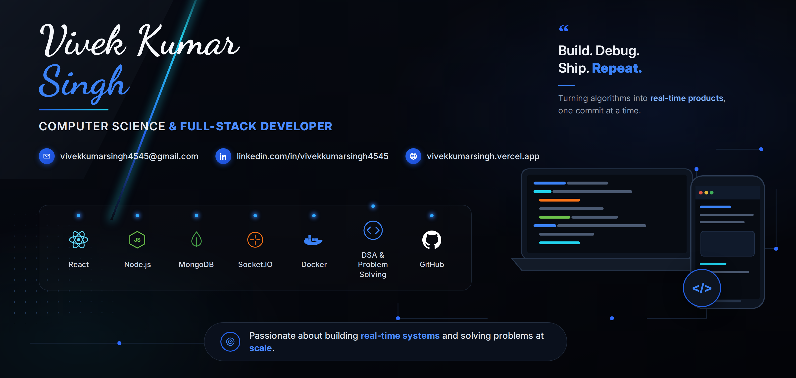

  

<h1 align="center">
  
</h1>

### 💫 Hi 👋, I'm Vivek Kumar Singh

**A passionate Full-Stack Developer (MERN) || Competitive Programmer from India**

🌐 **Portfolio:** [vivekkumarsingh.vercel.app](https://vivekkumarsingh.vercel.app)

- 🔭 **I'm currently working on:** DSABattle — a real-time 1v1 competitive coding platform
- 🌱 **I'm currently learning:** TypeScript, testing frameworks (Jest/Cypress), and cloud platforms (AWS/GCP)
- 👯 **I'm looking to collaborate on:** MERN stack projects with real-time features (Socket.IO/WebRTC)
- 🤔 **I'm looking for help with:** Scaling real-time systems and CI/CD pipelines
- 💬 **Ask me about:** MERN stack, DSA/Competitive Programming, System Design basics
- 📫 **Reach me at:** vivekkumarsingh4545@gmail.com
- ⚡ **Fun fact:** Solved 600+ DSA problems and still can't skip an unattempted LeetCode weekly contest

## 🌐 Socials:
   

## 💻 Tech Stack

<table>
<tr>
<td width="250"><b>Languages</b></td>
<td>

</td>
</tr>

<tr>
<td><b>Frontend</b></td>
<td>

</td>
</tr>

<tr>
<td><b>Backend & Real-Time</b></td>
<td>

</td>
</tr>

<tr>
<td><b>Databases</b></td>
<td>

</td>
</tr>

<tr>
<td><b>Tools & DevOps</b></td>
<td>

</td>
</tr>

</table> 

<!-- Snake Game Repo View -->

  

## 🚀 Featured Projects

### ⚔️ DSABattle – Real-Time 1v1 Competitive Coding Platform
**Tech Stack:** React.js • Node.js • Socket.IO • Monaco Editor • Docker

Real-time 1v1 competitive coding platform with a server-side judge supporting Python, Java, and C++.

**Highlights**
- ⚡ 89+ problems judged under a 5-second time limit with <100ms real-time event latency
- 💬 In-match chat, live scoreboard, and rematch-voting system
- 🐳 Containerized services with Docker, cutting deployment time by 40%
- 🏠 Optimized Socket.IO room management for sub-1-second match setup

---

### 🎟️ Eventara – MERN Event Booking Platform
**Tech Stack:** React.js • Node.js • Socket.IO • Razorpay • jsPDF • Nodemailer

Event booking platform with real-time seat-locking to eliminate double-bookings at scale.

**Highlights**
- 🔒 Real-time seat-locking via Socket.IO across 50+ concurrent users with 5-minute TTL locks
- 💳 Razorpay integration with checkout-time seat re-validation, cutting duplicate bookings by 90%
- 🎫 Automated QR-coded PDF ticket delivery via email in under 5 seconds
- 🔄 Automatic lock release on disconnect

---

### 💬 Zync – Real-Time Chat Application
**Tech Stack:** React.js • Node.js • Socket.IO • MongoDB • WebRTC

Real-time messaging app with delivery tracking and peer-to-peer calling.

**Highlights**
- ✅ 3-state message delivery tracking (sent/delivered/read) with <1s propagation latency
- 📞 WebRTC peer-to-peer audio/video calling with Socket.IO signaling
- 🔐 JWT dual-token authentication with HTTP-only cookies
- 📧 Automated welcome emails via Brevo SMTP

## 🏆 Achievements

- 🎓 **CGPA:** 8.1
- 💻 **600+ DSA Problems Solved** across LeetCode and CodeChef
- 📈 Ranked 485/33,040 in LeetCode Weekly Contest 467, solving all 4 problems
- ⭐ Peak ratings: **1662** LeetCode • **1633** CodeChef
- 🥉 Secured Rank 3/250+ in Encode 24.1 Contest at college
- 👥 Leadership experience as **Social Media & Content Head, Parola** and **Volunteer, IEEE**

# 📊 GitHub Stats:
 
 

### ✍️ Random Dev Quote

